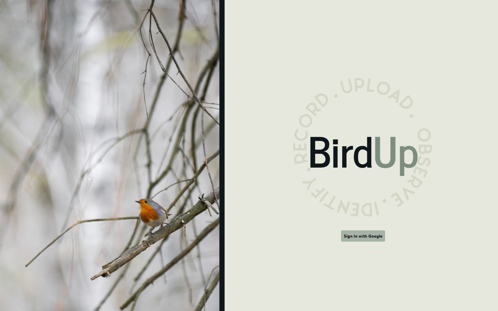
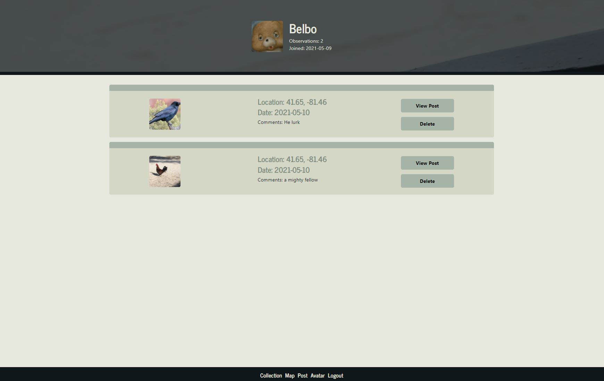
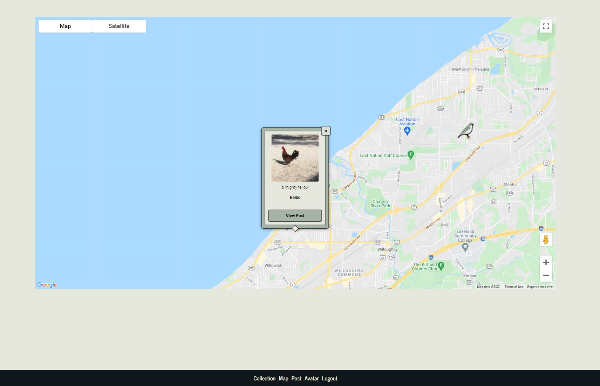

 
  # BirdUp 

  

  
  [Description](#description) |
    [Installation](#installation) |
    [URL](#url) |
    [Contributions](#contributions) |
    [Tests](#tests) |
    [License](#license) |
    [Questions](#questions) |
    [GitHub](#github) |
    [Email](#email)
    
  ## Description:
  a social image sharing site built in react with a mongo database. The application allows users to log in with google and make and update an account, make posts, and have pins set to a map for each post.

  ### Installation:
  n/a

  ### URL:
  https://aqueous-dawn-98851.herokuapp.com/

  ### Contributions:
  n/a

  ### Tests:
  n/a

  ### License:

  [Common License source](https://opensource.org/licenses)
  ## Questions.
  ### GitHub:
  [Adumbcoder](https://adumbcoder.github.io/PersonalProfile/)

  ### Email:
  pickensprogramming@gmail.com

  -[Back to Top](#)
## Screenshots:

